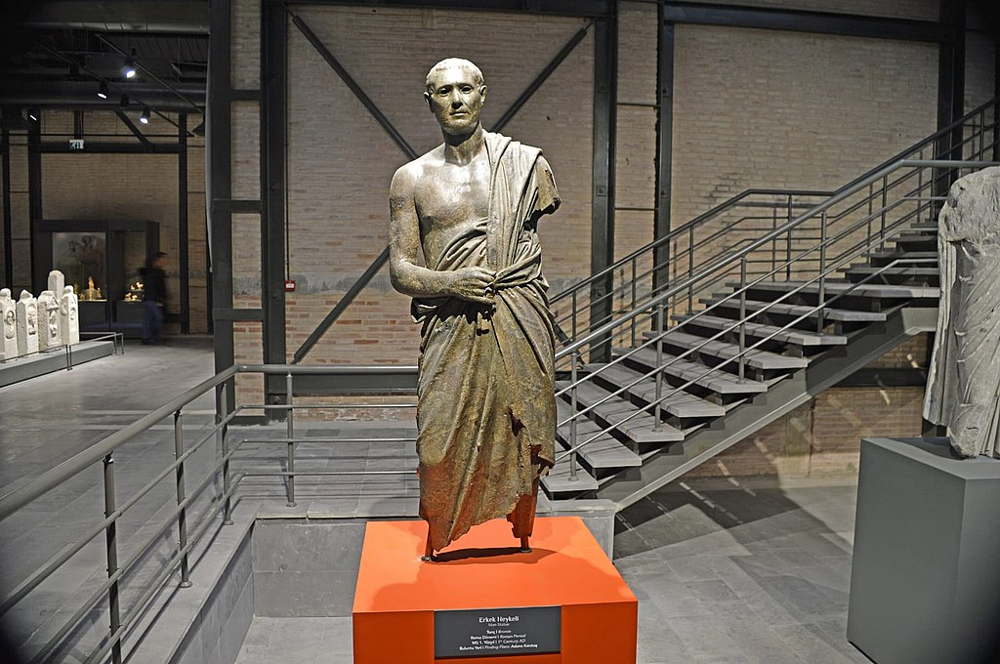
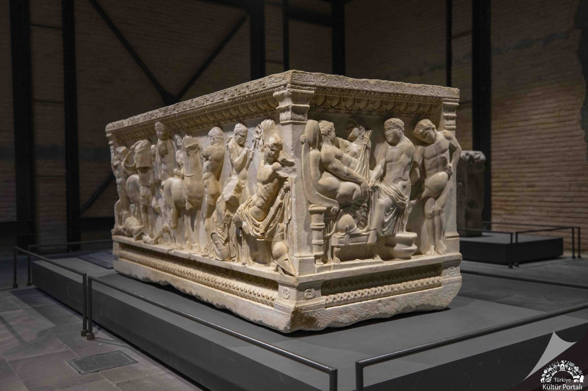
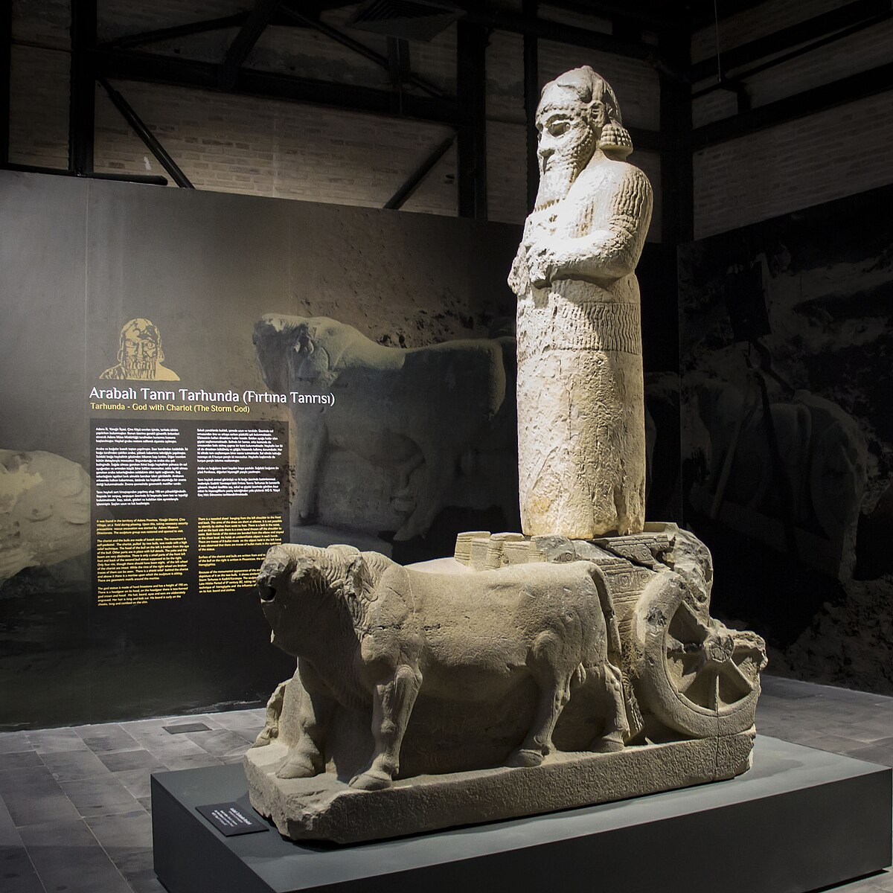
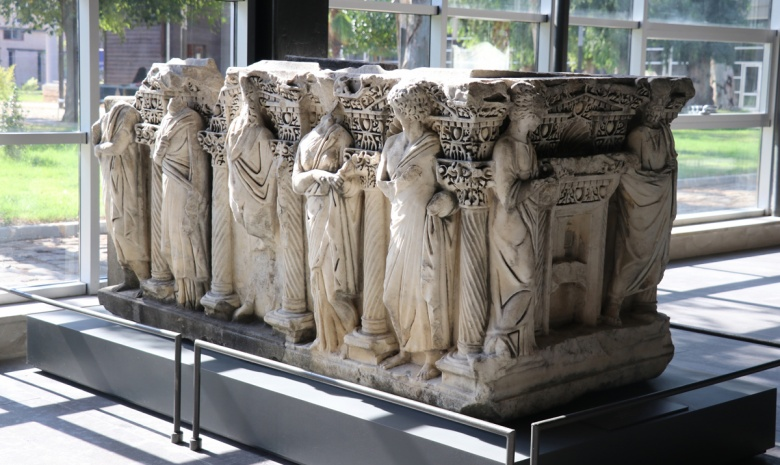
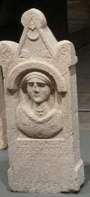

# Virtual Museum Project

## Overview
The Virtual Museum Project is an interactive 3D application that simulates a museum environment where users can explore and learn about historical artifacts from the Adana Museum. This application combines 3D modeling, real-time rendering, and informational content to provide an immersive educational experience.

## Features
- Interactive 3D environment with realistic lighting
- Robot-guided exploration with manual and automatic touring options
- Five detailed historical artifacts with complete information in both Turkish and English
- Scanning functionality that provides detailed information about each artifact
- Ambient lighting controls to adjust the viewing experience
- Intuitive user interface with popup information windows

## Technical Details

### Built With
- C++ (C++14)
- OpenGL 3.3
- GLFW (OpenGL Framework)
- GLM (OpenGL Mathematics)
- Dear ImGui (Immediate Mode GUI)
- GLAD (OpenGL Loading Library)
- STB Image (Image Loading)

### Key Components
1. **Main Application**: Handles window management, scene rendering, and user input
2. **Robot Control System**: Implements navigation, animation, and scanning functionality
3. **3D Model Management**: Loads and renders artifact models and pedestals
4. **Camera System**: Provides user viewport controls and movement
5. **User Interface**: Displays information and control panels using ImGui

## Critical Functions

### Core Application Functions
- `main()`: The entry point and main program loop 
- `framebuffer_size_callback()`: Handles window resizing events
- `processInput()`: Processes keyboard input for robot movement

### Robot Control Functions
- `Robot::update()`: Updates the robot's position, rotation, and animation
- `Robot::moveTo()`: Moves the robot to a target position
- `Robot::pointArmTo()`: Directs the robot's arm toward a specific position
- `Robot::startModelTour()`: Begins an automated tour of all artifacts

### Rendering Functions 
- Model, camera, and shader management classes handle the rendering pipeline
- `glm` library functions manage transformations and camera perspective
- `ImGui` functions create and manage the user interface elements

## Installation and Setup

### System Requirements
- GPU with OpenGL 3.3+ support
- Windows operating system (Windows 10/11 recommended)
- Visual Studio 2019 or 2022 with C++ development workloads installed

### Download and Setup Instructions
1. **Download the Project**
   - Download the project from this GitHub repository:
     [https://github.com/yuemco/virtual-adana-museum-v2-team-6]
   - Click the green "Code" button and select "Download ZIP"
   - Extract the ZIP file to a location on your computer

2. **Open in Visual Studio**
   - Open Visual Studio 2019/2022
   - Select "File" → "Open" → "Project/Solution"
   - Navigate to the extracted project folder
   - Select the "VirtualMuseumProject.sln" file and open it

3. **Configure Project Settings**
   - Make sure the configuration is set to "Release" in the top toolbar
   - Set the platform to "x64" 

4. **Build and Run**
   - Press F5 or click the "Local Windows Debugger" button to build and run the application
   - Alternatively, select "Build" → "Build Solution" (Ctrl+Shift+B) and then run the executable

## User Guide

### Manual Navigation
1. Use the **arrow keys** to move the robot around the museum:
   - Up arrow: Move forward
   - Down arrow: Move backward
   - Left arrow: Move left
   - Right arrow: Move right
2. Navigate the robot close to an artifact and remain stationary for a few seconds
3. The robot will automatically begin scanning the artifact
4. When scanning completes, detailed information about the artifact will appear
5. Click "Next" to close the information panel and continue exploring

### Automated Tour
1. Click the "Start Tour" button in the Virtual Museum panel
2. The robot will automatically move to each artifact in sequence
3. At each artifact, the robot will:
   - Position itself for optimal viewing
   - Scan the artifact
   - Display detailed information
4. Click "Next" after reading the information to proceed to the next artifact
5. Click "Stop Tour" at any time to end the automated tour

### Lighting Controls
1. Use the "Lighting Controls" panel in the upper right corner
2. Adjust the "Ambient Light" slider to change the overall brightness of the scene

### Exiting the Application
- Press the **ESC** key at any time to exit the application

## Artifacts in the Museum
1. **Erkek Heykeli / Statue of a Man**
   - Roman Period, 2nd century AD
   - Bronze statue depicting a man in a toga

2. **Lahit - Aslanli / Sarcophagus with Lion Reliefs**
   - Roman Period, 2nd century AD
   - Marble sarcophagus with lion reliefs

3. **Arabali Tanri Tarhunda / Chariot-Borne God Tarhunda**
   - Late Hittite Period, 9th century BC
   - Basalt stone statue of the storm god

4. **Lahit - Figurlu / Sarcophagus with Mythological Figures**
   - Roman Period, 2nd-3rd century AD
   - Marble sarcophagus with mythological scenes

5. **Kadin Rolyefli Mezar Steli / Funerary Stele with Female Relief**
   - Roman Period, 2nd-3rd century AD
   - Limestone funerary stele with female portrait
  
### Images and GIFs of UI and Models
**General View**   

**Movement of Robot**   

**Lighting Settings**   

1. **Erkek Heykeli / Statue of a Man**   

2. **Lahit - Aslanli / Sarcophagus with Lion Reliefs**   

3. **Arabali Tanri Tarhunda / Chariot-Borne God Tarhunda**   

4. **Lahit - Figurlu / Sarcophagus with Mythological Figures**   

5. **Kadin Rolyefli Mezar Steli / Funerary Stele with Female Relief**   

**Image Gallery**   
  
  
  
  
 
  
**You can also check the Overview-Video-Museum file in the repository to watch the final overview of our Virtual Museum Project.**  

## Troubleshooting
- **Model Loading Issues**: Ensure all model files are in the Models folder
- **Missing Textures**: Check that texture files (wall_orijinal.png) are in the correct directory
- **Build Errors**: Make sure Visual Studio has the C++ development workload installed
- **OpenGL Errors**: Update your graphics drivers to ensure OpenGL 3.3+ support
- **Performance Issues**: Adjust ambient lighting to improve visibility and performance

## Contributors
- This Virtual Museum Project was created as an educational application showcasing historical artifacts from the Adana Museum.
- Emre Samet Sezgin - 2021556057
- Fatma Nur Gençdoğan - 2022556401
- Gülse Ogultegin - 2021556049
- Hasibe Nur Tunç - 2021556067
- Zeynep Elif Göksu - 2021556033

## License
- This project is an educational application created for demonstration purposes.

     

# Virtual Museum Assignment

  
  
  
  
  

## Overview

In this assignment, you will develop a computer graphics project using **C++** and **OpenGL** to simulate a virtual museum environment. You will create a 3D room with realistic lighting, model 3D objects from provided images using Blender, and simulate a mobile robot equipped with a robot arm (or a similar scanning mechanism) that interacts with these objects. When an object is scanned, a pop-up screen will display detailed information about that object.

## Objectives

- **Scene Construction:**  
  Create a virtual museum room with at least one main light source. Extra points will be awarded for implementing additional spotlights.

- **3D Modeling:**  
  Model 5 museum objects (using images provided from Adana Museum) in Blender. Export these models and integrate them into your OpenGL scene.

- **Mobile Robot Simulation:**  
  Develop a mobile robot that navigates the room to visit and scan objects.  
  - The robot should be equipped with a robot arm or a scanning mechanism looks like an arm.  
  - Upon scanning an object, a pop-up UI should display information about that object.

- **User Interface:**  
  - Create UIs to control the mobile platform to visit objects automatically, scanning them from 1 to 5 and return initial position.
  - Create UIs to control the mobile platform to visit each object manually, the robot arm to scan the object, and the lighting (including light control switches for features such as spotlights).

## Plagiarism

- **Academic integrity is paramount.** Plagiarism, which involves **copying code, models or other project components from others**, is strictly prohibited. All submitted work must be your own original work. 

- **Scanning 3D models with an extra tool is prohibited.** 3D models must be created by you.

- **The images of the textures you will use in 3D models must also be created by you.**

- **If you use external sources or libraries, you must obtain permission from the source and prove this permission in your report.** You must cite them appropriately in your project documentation and in comments in your code.

Failure to follow these guidelines may result in disciplinary action, including a failing grade for the assignment. Make sure you understand the Çukurova University Computer Engineering academic integrity policies and consult Yunus Emre Cogurcu if you have any questions.

## Project Requirements

- **Programming Language:** C++
- **Graphics Library:** OpenGL - This project targets OpenGL 3.3 Core Profile
- **3D Modeling Tool:** Blender (for modeling and exporting 3D objects)
- **UI Framework:** Either custom-built or a UI library (e.g., ImGui) as specified
- **Version Control:** Git/GitHub for project submission and collaboration

## Deliverables

1. **Source Code:**  
   Well-organized and documented C++ and OpenGL 3.3 source code.

2. **3D Models:**  
   Blender files and exported models for the 5 museum objects. (Create a scene in Blender and model 5 objects in the same scene but export the objects one by one.)

3. **Executable:**  
   A buildable project that runs on the specified platform.

4. **Documentation:**  
   A detailed README (this document) explaining the project structure, build and run instructions, and details on controls and features.

5. **Demonstration Video (extra points):**  
   A short video demonstrating the robot’s functionality and UI controls.

## Evaluation Criteria

- **Scene Realism: (20 points)**  
  Quality of the 3D room, lighting effects, and the use of spotlights for each objects. When the robot comes in front of each object, the spotlight belonging to that object automatically lights up and the spotlight belonging to other objects would be nice to be dimmed at this time.

- **3D Modelling: (20 points)**  
  Modelling 3D objects via Blender.

- **Robot Simulation: (20 points)**  
  Functionality of the mobile robot including navigation. Scanning mechanics via robot arm.

- **UI Implementation: (20 points)**  
  Ease of use and functionality of the control interfaces for the robot and lighting.

- **Code Quality: (20 points)**  
  Structure (OOP), clarity, and documentation of the source code.

- **Bonus Points: (20 points)**  
  Extra features such as additional spotlights, enhanced physics for the robot arm, collision detection, advanced shading techniques, ray tracing etc.

## Suggested Workflow

1. ### Setup and Environment
   - Initialize your Git repository and project structure.
   - Set up your development environment with necessary libraries (OpenGL, GLM, GLEW/GLAD, etc.).

2. ### 3D Modeling
   - Use Blender to create and export the 5 museum object models.
   - Ensure the models are optimized for real-time rendering.

3. ### Scene and Lighting
   - Build the 3D room in OpenGL.
   - Implement the main light source and add additional spotlights for extra credit.

4. ### Robot and Interaction
   - Design and implement the mobile robot.
   - Develop the robot arm or scanning mechanism.
   - Program the scanning function to trigger a pop-up information screen when an object is scanned.

5. ### User Interface
   - Design a UI to control the robot’s movements and the robot arm.
   - Include buttons or switches for toggling lights (including spotlights).

6. ### Testing and Documentation
   - Test your project thoroughly.
   - Document your code and update this README with detailed build instructions, controls, and feature descriptions.
       (We have updated this README.)
